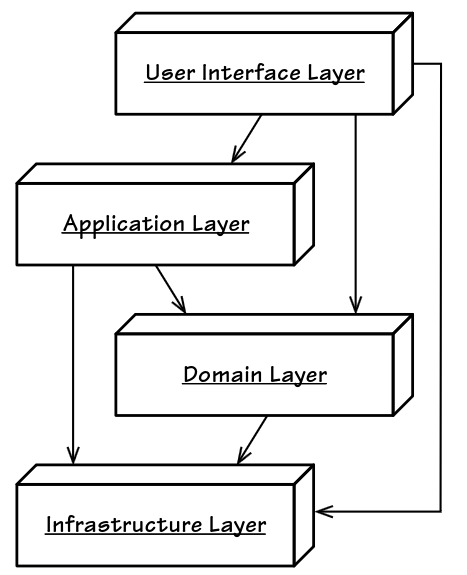
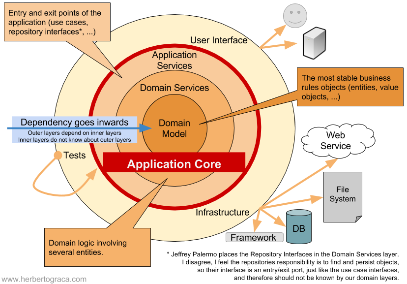
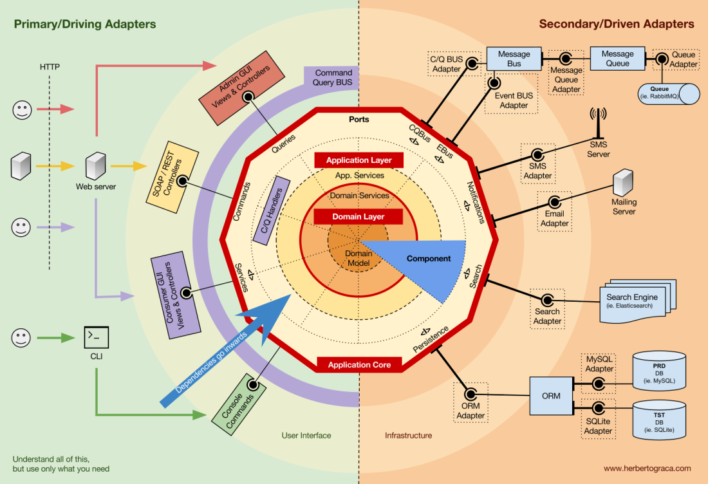

# Using Onion Architecture

## Context and Problem Statement

For the implementation of our sample application we need to decide for an architectural style that suits our purpose
(a showcase for DDD and Context Mapper) best.

## Considered Options

* Layered Architecture
* Onion Architecture
* Hexagonal Architecture (Ports & Adapters)

## Decision Outcome

We chose Onion Architecture for the following reasons.

With DDD and the classical 3-layer architecture (or n-layers as well) one runs into a problem that Vaughn Vernon
has already described in detail in his [red book](https://www.pearson.de/implementing-domain-driven-design-9780321834577).
One important goal when we implement DDD is that we want to keep the domain logic free from technology. The implementation
of the domain (logic) should not use libraries and frameworks; and it should also not depend on layers that contain such
infrastructure code. In the classical layered architecture the business logic layer (which we would rename to _domain layer_
when implementing DDD) depends on the data access layer (which is obviously not free from technology).

So, we would end up with something like this: (Image Source: [red book](https://www.pearson.de/implementing-domain-driven-design-9780321834577))

Note that Vaughn Vernon already renamed the classical _data access layer_ to _infrastructure layer_ here.

As already mentioned, with DDD we don't want to have that dependency from the _domain layer_ to the _infrastructure layer_.
Therefore, we have to adjust the classical layered architecture here. By using the Dependency Inversion Principle (DIP)
we can achieve to put the _infrastructure layer_ to the top:

(Image Source: [red book](https://www.pearson.de/implementing-domain-driven-design-9780321834577))

But what do we have here now? As Vaughn Vernon argues correctly in my point of view is that this no longer layered architecture.
At least not what people have in mind when we talk about layers. It's also not the layered architecture that students have
learned in their architecture courses; which might be relevant especially for us (teaching context). What this image
above actually shows is already Hexagonal Architecture, just a bit asymmetric.

So, long story short, Layered Architecture with DDD seems not to be a perfect fit. It would be possible (depending on how
flexible interprets how a layered architecture should look like) but it usually leads to confusion. Saying that one
implements a layered architecture kind of does not say anything anymore because you have to explain everything at first anyway.

Onion Architecture as well as Hexagonal Architecture (Ports & Adapters) solve this problem, because technology and infrastructure is always
outside and the core domain is inside. Dependencies are only allowed from _outside_ towards _inside_.

(Image Source: [Onion Architecture (hgraca)](https://herbertograca.com/2017/09/21/onion-architecture/))

(Image Source: [DDD, Hexagonal, Onion, Clean, CQRS, … How I put it all together (hgraca)](https://herbertograca.com/2017/11/16/explicit-architecture-01-ddd-hexagonal-onion-clean-cqrs-how-i-put-it-all-together/))

As we can anticipate from the illustrations above, Hexagonal Architecture seems a bit more complex then the Onion Architecture
approach. But the Onion architecture already comes with the benefits over layers that we need for implementing DDD.
We share this opinion with others as well; for example (GERMAN): [DDD mit Onion Architecture: 3 Gründe, weshalb Onion 
Architecture für die Umsetzung von Bounded Contexts nach Domain-driven Design besonders geeignet ist.](https://www.innoq.com/de/blog/ddd-mit-onion-architecture-umsetzen/) 

For that reason we decided for Onion Architecture. The sample app is not that complex and we don't necessarily need Hexagonal
Architecture. In our workshops and teaching contexts it will be easier to explain Onion Architecture, as it is not that complex.

### Consequences

* We talk about _rings_ and not _layers_.
* Layers might be better known by developers that haven't implemented DDD so far. That means we have to take care that we
  explain Onion Architecture good enough in our workshops and teaching sessions so that people do understand the code.
